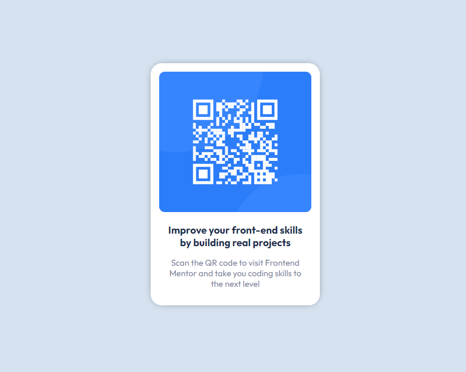

# Frontend Mentor - QR code component solution

This is a solution to the [QR code component challenge on Frontend Mentor](https://www.frontendmentor.io/challenges/qr-code-component-iux_sIO_H). Frontend Mentor challenges help you improve your coding skills by building realistic projects. 

## Table of contents

- [Overview](#overview)
  - [Screenshot](#screenshot)
  - [Links](#links)
- [My process](#my-process)
  - [Built with](#built-with)
- [Author](#author)

## Overview

### Screenshot

### Links

- Solution URL: [See here](https://github.com/WanderFeliz/qr-code-component)
- Live Site URL: [See here](https://wanderfeliz.github.io/qr-code-component)

## My process

### Built with

- Flexbox
- [React](https://reactjs.org/) - JS library
- [Styled Components](https://styled-components.com/) - For styles

## Author

- Website - [Wander Paniagua](https://wanderfeliz.github.io/me)
- Frontend Mentor - [@WanderFeliz](https://www.frontendmentor.io/profile/WanderFeliz)